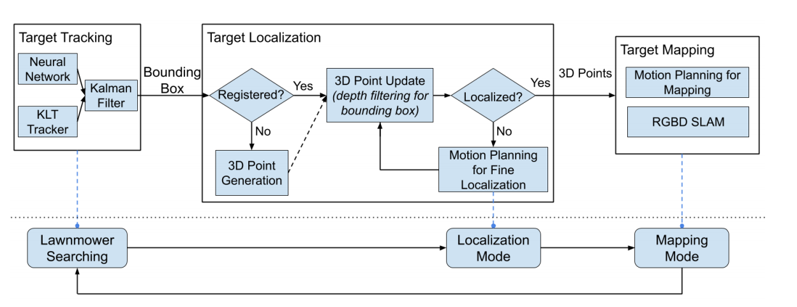
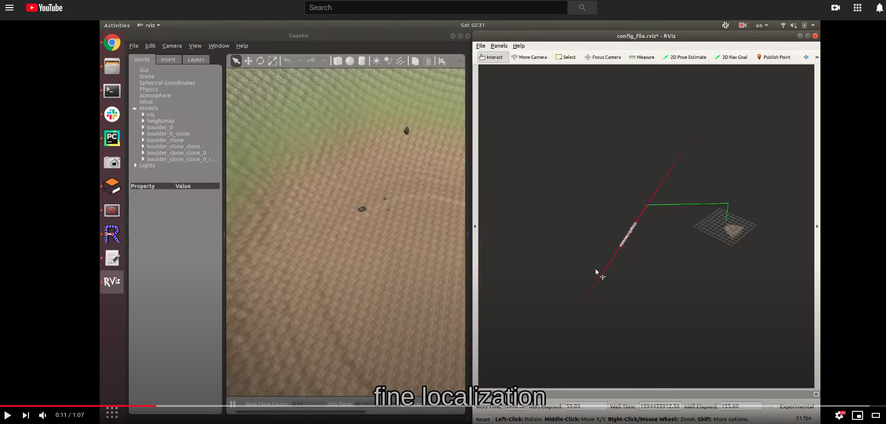
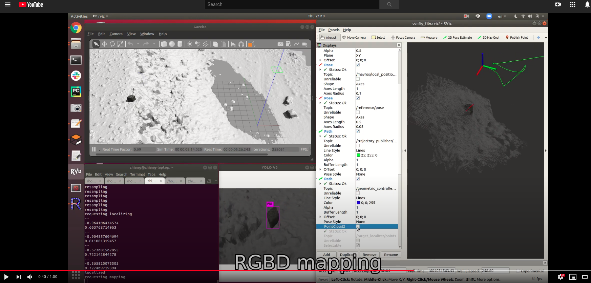

# target_mapping
Apache License 2.0 (c) 2020 Distributed Robotic Exploration and Mapping Systems Laboratory, ASU

Zhiang Chen, Jan 2020

_Find more info on [Github Wiki](https://github.com/ZhiangChen/target_tracking/wiki)_
or our paper [Localization and Mapping of Sparse Geologic Features with Unpiloted Aircraft Systems](https://arxiv.org/pdf/2007.01220.pdf)


## Overview
#### Systworkflow


#### Video demos
1. DEM world
[](https://www.youtube.com/watch?v=Ve06vQi3AlU)

2. granite dell world
[](https://www.youtube.com/watch?v=-QrIqSm2awo)

## Dependences
[darknet_ros](https://github.com/leggedrobotics/darknet_ros): ROS implementation of YOLO real-time detection   
[rtabmap_ros](http://wiki.ros.org/rtabmap_ros): RGBD SLAM  
[uav_motion](https://github.com/ZhiangChen/uav_motion): minimum-snap trajectory generation and attitude control for PX4-based rotary wing drones

## ROS Nodes
#### 1. bbox_tracker.py
Tracking bounding boxes using Kalman filtering.  
subscribers:
- /darknet_ros/bounding_boxes
- /r200/rgb/image_raw

publishers:
- /bbox_tracker/detection_image
- /bbox_tracker/bounding_boxes

#### 2. target_localizer.py  
Localizing targets using bounding-box-based depth filter.  
subscribers:
- /bbox_tracker/bounding_boxes*
- /mavros/local_position/pose*
* the messages from these two topics are synchronized using ROS [message_filters](http://wiki.ros.org/message_filters)

publishers:
- /target_localizer/ellipsoids
- /target_localizer/points

action clients:
- /path_planner/target_plan

#### 3. path_planner.py
Planning the fine localization and mapping.  
action servers:
- /path_planner/target_plan

action clients:
- waypoints

service clients:
- stop_sampling
- /rtabmap/resume
- /rtabmap/pause
- /rtabmap/trigger_new_map
- /rtabmap/reset
- /rtabmap/reset_odom_to_pose

subscribers:
- /mavros/local_position/pose
- /rtabmap/cloud_map

#### 4. rtabmap.launch
Mapping targets.
```
roslaunch target_mapping rtabmap.launch
```

#### 5. darknet_ros_pbr.launch
Detecting targets, e.g. precariously balanced rocks (pbrs). The weights and network configurations need to be customized.
```
roslaunch darknet_ros darknet_ros_pbr.launch
```

#### 6. uav_motion.launch
UAV motion system.
```
roslaunch uav_motion uav_motion.launch
```

## Simulations
#### Models
[gazebo_sim_models](https://github.com/ZhiangChen/ros_vision)  
[pbr_gazebo](https://github.com/DREAMS-lab/pbr_gazebo)

#### Launch the environments
1. DEM world 
```
roslaunch gazebo_sim_models mavros_iris_boulder_terrain.launch  
```

2. granite dell world
```
roslaunch gazebo_sim_models mavros_iris_granite_dell.launch
```

## Citation
Please cite this paper if you use the code or algorithms from this work ;)
```
@article{chen2020localization,
  title={Localization and Mapping of Sparse Geologic Features with Unpiloted Aircraft Systems},
  author={Chen, Zhiang and Bearman, Sarah and Arrowsmith, J Ramon and Das, Jnaneshwar},
  journal={arXiv preprint arXiv:2007.01220},
  year={2020}
}
```
