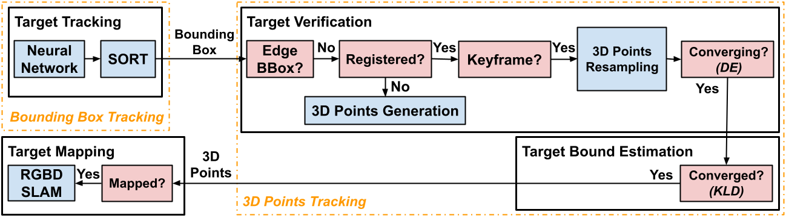
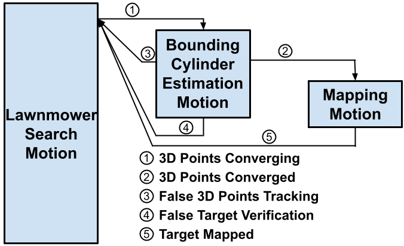
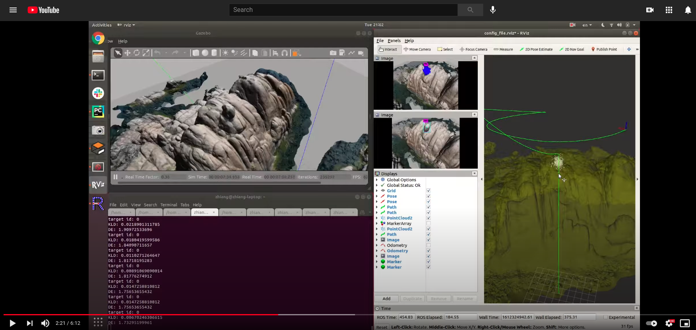
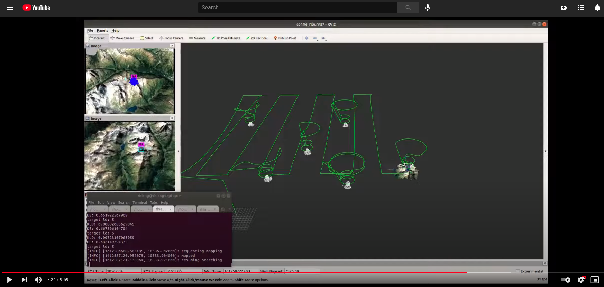

# target_mapping
Apache License 2.0 (c) 2020 Distributed Robotic Exploration and Mapping Systems Laboratory, ASU

Zhiang Chen, Jan 2020

_Find more info can be found on [Github Wiki](https://github.com/ZhiangChen/target_tracking/wiki)_  
_and our paper [Localization and Mapping of Sparse Geologic Features with Unpiloted Aircraft Systems](https://arxiv.org/pdf/2007.01220.pdf)_


## Overview
#### Perception subsystem workflow


#### Motion state diagram


#### Video demos
1. Granite Dells
[](https://www.youtube.com/watch?v=re9vSJIFIKY&t=141s)

2. Blender field
[](https://www.youtube.com/watch?v=lPZsW6v9K04&t=444s)

## Dependences
[darknet_ros](https://github.com/leggedrobotics/darknet_ros): ROS implementation of YOLO real-time detection   
[rtabmap_ros](http://wiki.ros.org/rtabmap_ros): RGBD SLAM  
[uav_motion](https://github.com/ZhiangChen/uav_motion): minimum-snap trajectory generation and attitude control for PX4-based rotary wing drones
[ros_iou_tracking](https://github.com/ZhiangChen/ros_iou_tracking): ROS implementation of simple online realtime tracking (SORT)

## ROS Nodes
#### 1. iou_tracker.py
Tracking bounding boxes using SORT.  
Publications: 
 * /bbox_tracker/bounding_boxes [darknet_ros_msgs/BoundingBoxes]
 * /iou_tracker/detection_image [sensor_msgs/Image]
 * /rosout [rosgraph_msgs/Log]

Subscriptions: 
 * /clock [rosgraph_msgs/Clock]
 * /darknet_ros/bounding_boxes [darknet_ros_msgs/BoundingBoxes]
 * /darknet_ros/detection_image [sensor_msgs/Image]

#### 2. target_tracker.py  
3D points tracker
Publications: 
 * /path_planner/target_plan/cancel [actionlib_msgs/GoalID]
 * /path_planner/target_plan/goal [target_mapping/TargetPlanActionGoal]
 * /rosout [rosgraph_msgs/Log]
 * /target_tracker/detection_image [sensor_msgs/Image]
 * /target_tracker/ellipsoids [visualization_msgs/MarkerArray]
 * /target_tracker/points [sensor_msgs/PointCloud2]

Subscriptions: 
 * /bbox_tracker/bounding_boxes_drop [unknown type]
 * /clock [rosgraph_msgs/Clock]
 * /darknet_ros/detection_image [sensor_msgs/Image]
 * /mavros/local_position/pose [geometry_msgs/PoseStamped]
 * /path_planner/target_plan/feedback [unknown type]
 * /path_planner/target_plan/result [unknown type]
 * /path_planner/target_plan/status [unknown type]

#### 3. path_planner.py
Planning the lawnmower search, b-cylinder estimation motion, and mapping motion.  
Publications: 
 * /local_path [nav_msgs/Path]
 * /path_planner/cylinder_marker [visualization_msgs/Marker]
 * /path_planner/target_plan/feedback [target_mapping/TargetPlanActionFeedback]
 * /path_planner/target_plan/result [target_mapping/TargetPlanActionResult]
 * /path_planner/target_plan/status [actionlib_msgs/GoalStatusArray]
 * /rosout [rosgraph_msgs/Log]
 * /waypoints/cancel [actionlib_msgs/GoalID]
 * /waypoints/goal [uav_motion/waypointsActionGoal]

Subscriptions: 
 * /clock [rosgraph_msgs/Clock]
 * /mavros/local_position/pose [geometry_msgs/PoseStamped]
 * /path_planner/target_plan/cancel [actionlib_msgs/GoalID]
 * /path_planner/target_plan/goal [target_mapping/TargetPlanActionGoal]
 * /rtabmap/cloud_map [sensor_msgs/PointCloud2]
 * /waypoints/feedback [uav_motion/waypointsActionFeedback]
 * /waypoints/result [uav_motion/waypointsActionResult]
 * /waypoints/status [actionlib_msgs/GoalStatusArray]

#### 4. rtabmap.launch
Mapping targets.
```
roslaunch target_mapping rtabmap.launch
```

#### 5. darknet_ros_pbr.launch
Detecting targets, e.g. precariously balanced rocks (pbrs). The weights and network configurations need to be customized.
```
roslaunch target_mapping sort_tracker.launch
```

#### 6. uav_motion.launch
UAV motion system.
```
roslaunch uav_motion uav_motion.launch
```

## Simulations
### 1. Models
[gazebo_sim_models](https://github.com/ZhiangChen/ros_vision): Download .dae files of models  

### 2. Launch environments
(1) Granite Dells world 
```
roslaunch gazebo_sim_models mavros_iris_granite_dell_v2.launch
```

(2) Blender field world
```
roslaunch gazebo_sim_models mavros_iris_blender_terrain.launch
```

### 3. Launch target mapping
```buildoutcfg
roslaunch gazebo_sim_models mavros_iris_granite_dell_v2.launch
roslaunch target_mapping sort_tracker.launch
roslaunch uav_motion uav_motion.launch
rosrun target_mapping target_tracker.py
roslaunch target_mapping rtabmap.launch
rosrun target_mapping path_planner.py
```

## Results Visualization
You can run `map_assembler.py` to merge all mapped targets and display them in rviz, or use the APIs in `map_assembler.py` to display point cloud with open3d.

## Configurations
Parameters are defined in `config/target_mapping.yaml`. E.g.,
```buildoutcfg
half_vfov: 0.3490658503988659 #20/180.*np.pi # half vertical fov for mapping
trans_threshold: 1.5  # keyframe selection (trans)
rot_threshold: 0.5235987755982988  # 30/180.*np.pi # keyframe selection (rot)
nm: 2000  # number of 3D points per target

# granite dell
z_min: 3 
z_max: 18
trigger_converging_DE: 3. 
alpha: 0.6981317007977318  # 40. / 180 * np.pi  # z axis for mapping
bcem_alpha: 0.6981317007977318  # z axis for b-cylinder estimation motion
```

## Citation
Please cite this paper if you use the code or algorithms from this work ;)
```
@article{chen2020localization,
  title={Localization and Mapping of Sparse Geologic Features with Unpiloted Aircraft Systems},
  author={Chen, Zhiang and Bearman, Sarah and Arrowsmith, J Ramon and Das, Jnaneshwar},
  journal={RSS Workshop on Robots in the Wild},
  year={2020}
}
```
