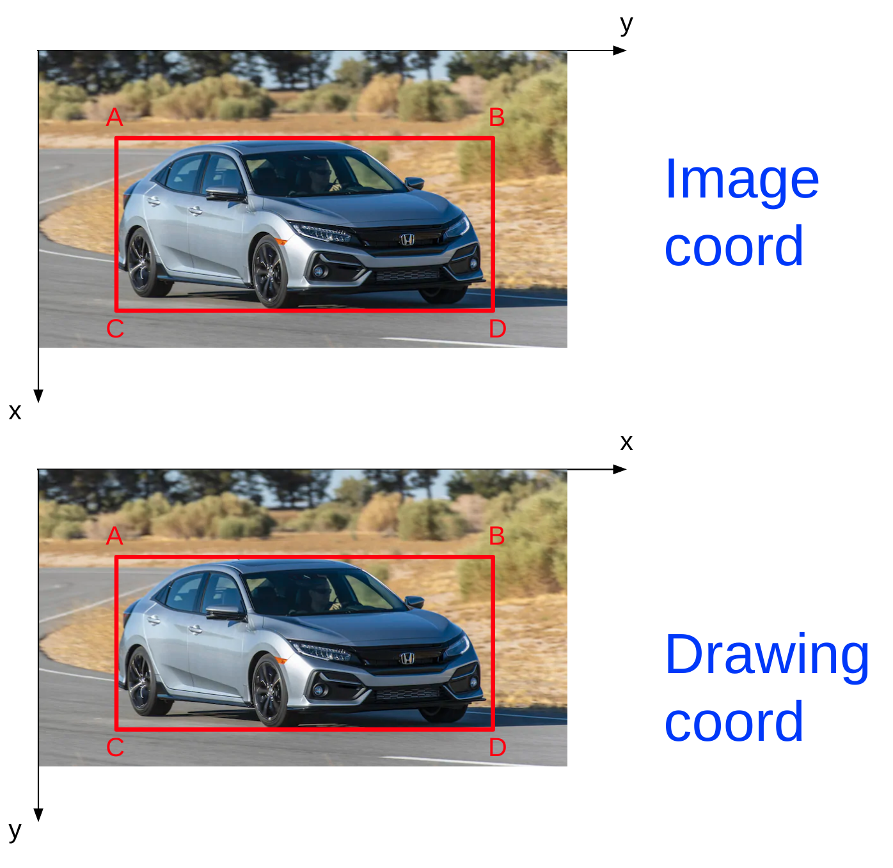
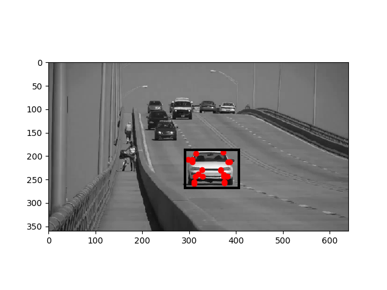

# target_mapping
Apache License 2.0 (c) 2020 Distributed Robotic Exploration and Mapping Systems Laboratory, ASU

Zhiang Chen, Jan 2020

## Workflow
1. Deep learning object detection
2. KLT tracker
3. Kalman filtering to fuse bounding boxes from deep learning and KLT tracker
4. Camera model to generates a cone from the refined bounding box
5. Particle filtering to produce pointclouds of targets.

_Find more info on [Wiki](https://github.com/ZhiangChen/target_tracking/wiki)_

## ROS Packages
#### 1. [darknet_ros](https://github.com/leggedrobotics/darknet_ros)
It generates bounding boxes using deep neural networks.

#### 2. target_tracking
a. bbox_tracker(Kalman filter)  
subscriber_1: bbox from deep learning  
subscriber_2: bbox from KLT  
publisher_1: refined bbox  

b. target_tracker(Particle filter)  
subscriber_1: refined bbox from bbox_tracker  
subscriber_2: coarse global coordinates of camera  
publisher_1: pointcloud estimation of targets

## Simulation
#### 1. ros packages
[gazebo_sim_models](https://github.com/ZhiangChen/ros_vision)  
[terrain_following](https://github.com/ZhiangChen/ros_vision/tree/vel_control/terrain_following)  
#### 2. commands
Terrain following navigation:  
```
roslaunch gazebo_sim_models mavros_iris_boulder_terrain.launch  
rosrun terrain_following perception_model_cpp_main
rosrun terrain_following mavros_vel_controller.py
rosrun terrain_following waypoints_action_client.py
```
[YOLO](https://github.com/leggedrobotics/darknet_ros) (customized training is required):  
```
roslaunch darknet_ros darknet_ros_pbr.launch
```

## Conventions
#### 1. image coordinate systems



#### 2. bounding box coordinate system


Bounding box uses the drawing coordinate system. The following is an example  
`bbox = np.array([[[291,187],[405,187],[291,267],[405,267]]])`  
If we want to crop an image with a bounding box,  
```buildoutcfg
(xmin, ymin, boxw, boxh) = cv2.boundingRect(bbox[0,:,:].astype(int))
roi = img[ymin:ymin+boxh,xmin:xmin+boxw]
```
